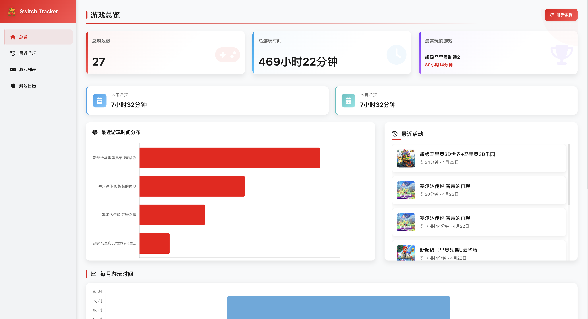
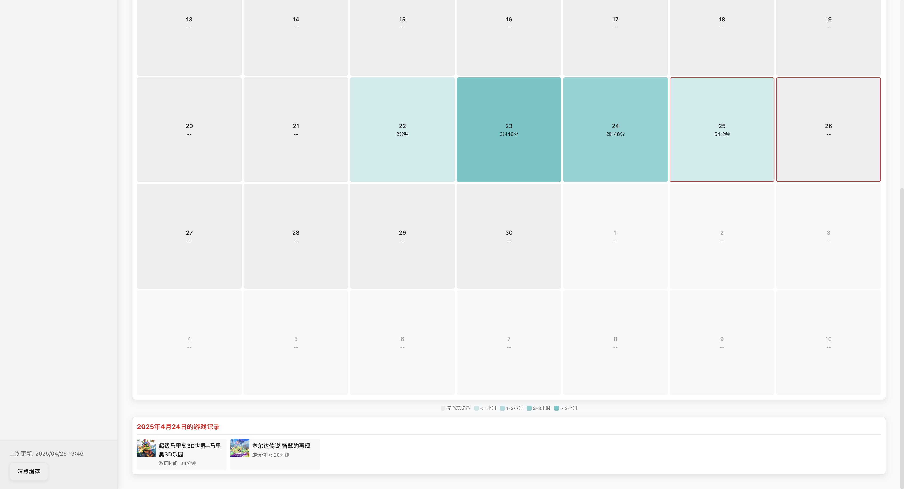
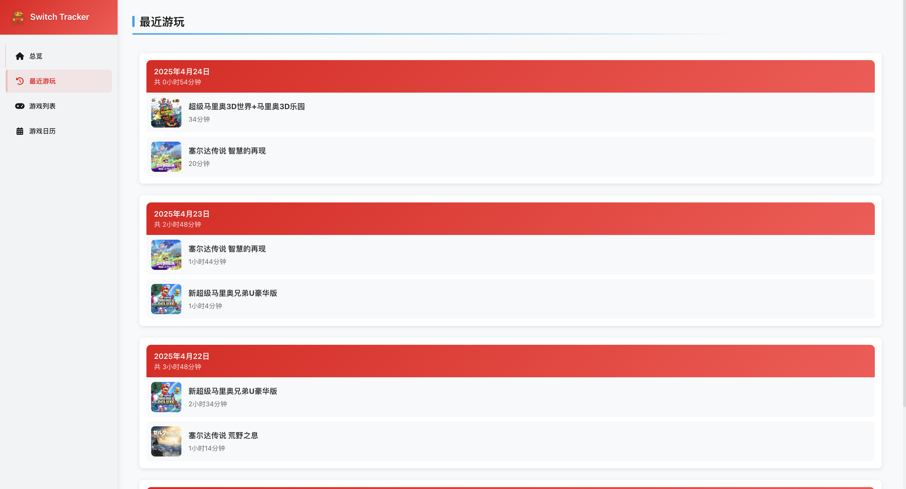

# Switch Tracker 任天堂游戏时间追踪器

一个用于收集、记录和可视化Nintendo Switch游戏时间的追踪工具。



## 功能特点

- **自动数据收集**：从Nintendo账号自动获取游戏记录数据
- **游戏时间统计**：追踪并记录每日游戏时间
- **可视化报表**：生成美观的图表展示游戏时间分布
- **游戏日历**：查看每日游戏记录
- **游戏库管理**：浏览和搜索您的所有游戏
- **中文支持**：游戏名称中文翻译功能

## 系统截图

### 总览界面


### 游戏日历


### 游戏列表


### 最近游玩


## 安装步骤

1. **克隆仓库**
   ```bash
   git clone https://github.com/your-username/switch_tracker.git
   cd switch_tracker
   ```

2. **安装依赖**
   ```bash
   pip install -r requirements.txt
   ```

## 使用说明

### 获取游戏数据

```bash
python get_switch_data.py
```

首次运行时，程序会引导您登录Nintendo账号并授权访问。成功授权后，会保存令牌用于后续使用。

### 游戏名称翻译

由于Nintendo返回的游戏名称通常为日文或英文，您可以使用翻译工具将其转换为中文：

```bash
# 导出未翻译的游戏到CSV文件
python game_translation.py export

# 在编辑CSV文件添加翻译后，导入翻译
python game_translation.py import

# 应用翻译到现有游戏
python game_translation.py apply
```

CSV文件(`game_translations.csv`)格式示例：

```
title_id,japanese_name,chinese_name
01000320000CC000,ゼルダの伝説 ブレス オブ ザ ワイルド,塞尔达传说 旷野之息
```

### 定期自动收集数据

您可以设置定时任务每天自动收集数据：

```bash
python daily_collect.py
```

在Linux/macOS上，您可以通过crontab设置定时任务：
```
0 23 * * * cd /path/to/switch_tracker && python daily_collect.py
```

### 运行Web服务器

```bash
python server.py
```

启动后，在浏览器中访问 `http://localhost:8000` 查看您的游戏统计数据。

## 数据库结构

数据保存在SQLite数据库`switch_tracker.db`中，主要表结构：

- `games` - 游戏基本信息
- `game_history` - 游戏历史记录和总游戏时间
- `daily_play` - 每日游玩记录
- `game_translations` - 游戏名称翻译

## 贡献

本项目大部分代码有 Cursor 完成，着实不怎么做前后端的内容。欢迎各位大佬一起优化一下！

## 许可

本项目采用 [MIT License](LICENSE) 开源许可协议。 