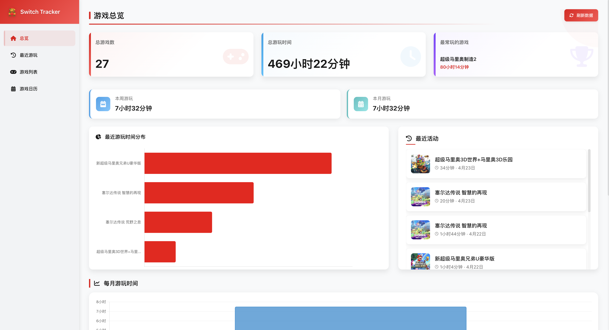
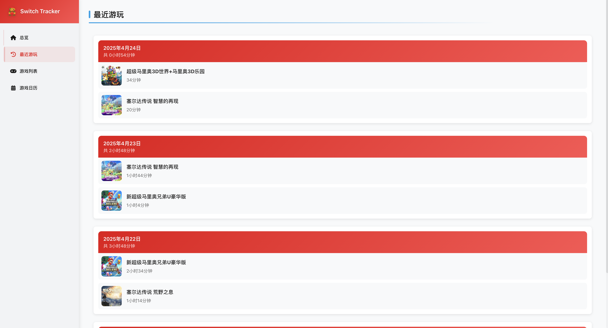
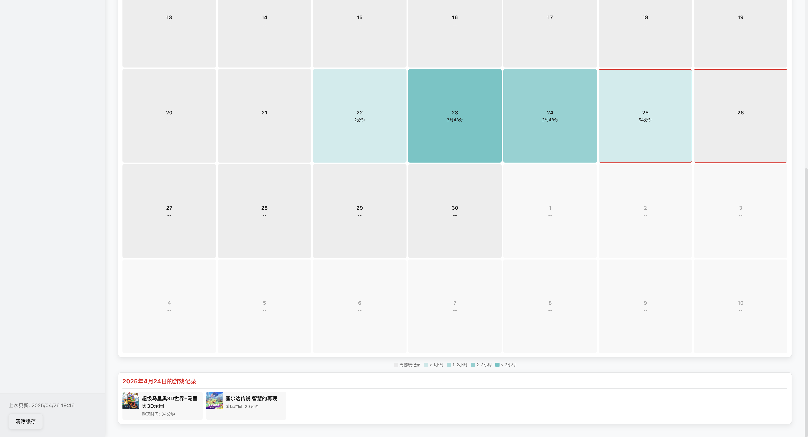

<div align="center">


# Switch Tracker

**把散落在 Nintendo 账户里的游玩记录，变成属于自己的本地游戏日志。**

[功能](#功能) · [快速开始](#快速开始) · [项目设计](#项目设计) · [路线图](#路线图) · [参与贡献](#参与贡献)

</div>

[](https://github.com/pengchzn/switch_tracker/actions/workflows/ci.yml)
[](LICENSE)
[](https://www.python.org/)

一个本地优先、非商业的 Nintendo Switch 游玩时间记录与可视化工具。数据保存在自己的电脑上，并通过 Web 仪表盘展示趋势、游戏列表和日历。

## 我为什么做这个项目

Nintendo Switch 自带的游玩记录适合快速查看，但不方便长期整理和回顾。我想知道自己每个月玩了多久、最近更常打开哪些游戏，也希望这些记录由自己保存，而不是只能依赖平台界面。

Switch Tracker 因此从一个个人脚本逐步变成了现在的小型本地应用。它仍然是我在业余时间维护的个人项目：优先解决自己真实使用中遇到的问题，同时尽量把安装、隐私和贡献流程做完整。

**当前状态：持续开发中。** 核心采集、SQLite 存储、可视化和中文名称翻译已经可用；Nintendo 接口变化、跨平台体验和前端测试仍会继续完善。实际进展记录在 [CHANGELOG.md](CHANGELOG.md)，后续计划见 [ROADMAP.md](ROADMAP.md)。

> [!IMPORTANT]
> 本项目是非官方社区项目，与 Nintendo 没有隶属、授权或背书关系。接口可能随时发生变化。请只访问自己的账户数据，并自行确认使用方式符合所在地区的法律和相关服务条款。

## 功能

- 自动收集游戏总时长和每日游玩记录
- 幂等更新：重复采集同一天的数据不会重复累计
- 总览、月度趋势、最近活动、游戏列表和日历视图
- 本地 CSV 游戏名称翻译
- 本地优先存储；令牌、数据库、日志和原始响应默认不进入 Git
- 适合 cron 等任务调度器的单次采集命令

## 界面预览

| 总览 | 最近游玩 |
| --- | --- |
|  |  |

| 游戏日历 | 游戏列表 |
| --- | --- |
|  |  |

## 快速开始

要求 Python 3.9 或更高版本。

```bash
git clone https://github.com/pengchzn/switch_tracker.git
cd switch_tracker

python3 -m venv .venv
source .venv/bin/activate        # Windows: .venv\Scripts\activate
python -m pip install --upgrade pip
python -m pip install -r requirements.txt
```

首次收集数据：

```bash
python get_switch_data.py
```

终端会输出 Nintendo 登录链接。登录并选择账户后，将回调链接粘贴回终端。会话令牌保存在 `config/tokens.json`，文件权限会限制为当前用户可读写。

启动本地仪表盘：

```bash
python server.py
```

访问 <http://127.0.0.1:8000>。服务默认只监听本机回环地址，不应直接暴露到公网。

## 定时采集

`daily_collect.py` 只执行一次采集并返回可靠的退出码，不会擅自重启 Web 服务：

```bash
python daily_collect.py
```

cron 示例：

```cron
0 23 * * * cd /path/to/switch_tracker && .venv/bin/python daily_collect.py
```

如果确实需要保存 API 原始 JSON 响应，可显式启用：

```bash
python get_switch_data.py --archive-json
```

原始响应可能包含个人活动信息，因此默认不保存，并且 `history_data/` 已被 Git 忽略。

## 游戏名称翻译

```bash
python game_translation.py export
# 编辑 game_translations.csv 中的 chinese_name
python game_translation.py import
```

导入时会同步更新数据库，无需额外执行 `apply`；为兼容旧用法，`apply` 命令仍然可用。

## 配置

| 环境变量 | 默认值 | 用途 |
| --- | --- | --- |
| `SWITCH_TRACKER_DB` | `./switch_tracker.db` | 自定义 SQLite 文件路径 |
| `SWITCH_TRACKER_HOST` | `127.0.0.1` | Web 服务监听地址 |
| `SWITCH_TRACKER_PORT` | `8000` | Web 服务端口 |
| `FLASK_DEBUG` | `0` | 仅本地开发时设为 `1` |
| `LOG_LEVEL` | `INFO` | Web 服务日志级别 |

将监听地址改为 `0.0.0.0` 会允许局域网中的设备访问。这样做之前，应配置防火墙或可信反向代理；本项目目前没有用户认证。

## 项目设计

这个项目刻意保持轻量：Python 负责认证和采集，SQLite 负责本地持久化，Flask 提供只读 API，浏览器完成可视化。没有外部数据库，也不要求注册额外的云服务。

```text
Nintendo account
       │
       ▼
get_switch_data.py ──► tracker_db.py ──► SQLite
                                            │
                                            ▼
Browser dashboard ◄── JSON API ◄── server.py
```

几个核心取舍：

- **本地优先**：令牌和游玩数据默认不离开用户设备。
- **重复执行安全**：同一天的数据采用更新而非累加，定时任务可以放心重跑。
- **保守暴露**：Web 服务默认只监听本机，并且不会把仓库目录作为静态文件目录。
- **小步维护**：优先使用 Python、SQLite 和原生 JavaScript，避免不必要的基础设施。

更详细的模块边界和数据流见 [docs/architecture.md](docs/architecture.md)。

## 数据与隐私

- `config/tokens.json`：Nintendo 会话和访问令牌，敏感。
- `switch_tracker.db`：游戏及游玩历史，属于个人活动数据。
- `history_data/`：可选的原始 API 响应，可能包含更多个人数据。
- `*.log`：运行日志。

这些路径都在 `.gitignore` 中。提交前仍建议运行：

```bash
git status --short
git grep -nE 'session_token|access_token' -- ':!README.md'
```

若发现真实令牌曾被提交，请先在 Nintendo 账户侧撤销会话，再清理 Git 历史；仅删除最新文件不足以撤销泄露。

## 开发与测试

```bash
python -m pip install -r requirements-dev.txt
ruff check .
pytest
node --check script.js
```

测试使用临时数据库，不会读取或修改真实令牌与个人游玩数据。项目结构：

- `get_switch_data.py`：认证和数据采集
- `tracker_db.py`：数据库建表、迁移及幂等持久化
- `server.py`：本地仪表盘与只读 JSON API
- `game_translation.py`：CSV 翻译工作流
- `daily_collect.py`：供调度器调用的单次采集入口
- `templates/`、`script.js`、`styles.css`：仪表盘前端

## 路线图

近期重点包括认证失败提示、数据导入导出、更多统计维度以及前端自动化测试。完整、可调整的计划见 [ROADMAP.md](ROADMAP.md)。路线图表达方向，不承诺固定交付日期。

## 参与贡献

欢迎提交问题与改进。开始前请阅读 [CONTRIBUTING.md](CONTRIBUTING.md)；安全问题请按 [SECURITY.md](SECURITY.md) 私下报告，不要创建公开 Issue。

如果你也在维护自己的 Switch 游玩记录，欢迎分享使用场景。Bug 报告、文档修正和小范围改进都很有帮助。

## 维护者

由 [Chen Peng](https://github.com/pengchzn) 在业余时间开发和维护。

## 许可证

代码采用 [MIT License](LICENSE)。Nintendo、Nintendo Switch 及相关标识是其各自权利人的商标；MIT License 不授予任何第三方商标权。
