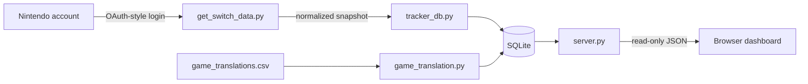

# Architecture

本文面向希望理解或修改 Switch Tracker 的开发者，描述主要模块、数据流和安全边界。

## Data flow

## Module responsibilities

| Module | Responsibility |
| --- | --- |
| `get_switch_data.py` | Nintendo 登录流程、令牌刷新、获取游玩记录 |
| `tracker_db.py` | schema 创建、旧数据库迁移、事务及幂等写入 |
| `server.py` | 本地页面、只读 API、静态资源白名单和安全响应头 |
| `daily_collect.py` | 为 cron 等调度器提供单次执行入口和可靠退出码 |
| `game_translation.py` | 翻译 CSV 的导出、导入及数据库同步 |
| `script.js` | 页面状态、图表、列表、搜索、排序和日历交互 |

## Storage model

- `games` 保存相对稳定的游戏元数据和可选中文名称。
- `game_history` 保存每次采集时的累计快照，用于保留历史变化。
- `daily_play` 以 `(title_id, played_date)` 为自然唯一键；再次采集同一天时覆盖旧值。
- 每日快照按采集时刻比较，仅接受同一时刻或更新的记录，允许时长修正为零。带时区的时间按 UTC 比较；旧版无时区采集时间按 UTC 解释。检查与写入在同一写事务中执行。
- `game_translations` 保存原始名称与人工维护的中文名称。

数据库迁移在 `init_database()` 中执行，并由回归测试覆盖旧版本重复数据的去重场景。

## Trust boundaries

Nintendo 响应、游戏名称和图片 URL 都被视为外部输入。后端使用参数化 SQL；前端对动态文本转义，并只接受 HTTPS 或同源图片。Web 服务仅提供明确列出的静态文件，不提供仓库根目录浏览。

令牌、SQLite 数据库和原始响应属于本地敏感数据。它们不会进入 API 响应，也被 `.gitignore` 排除。
